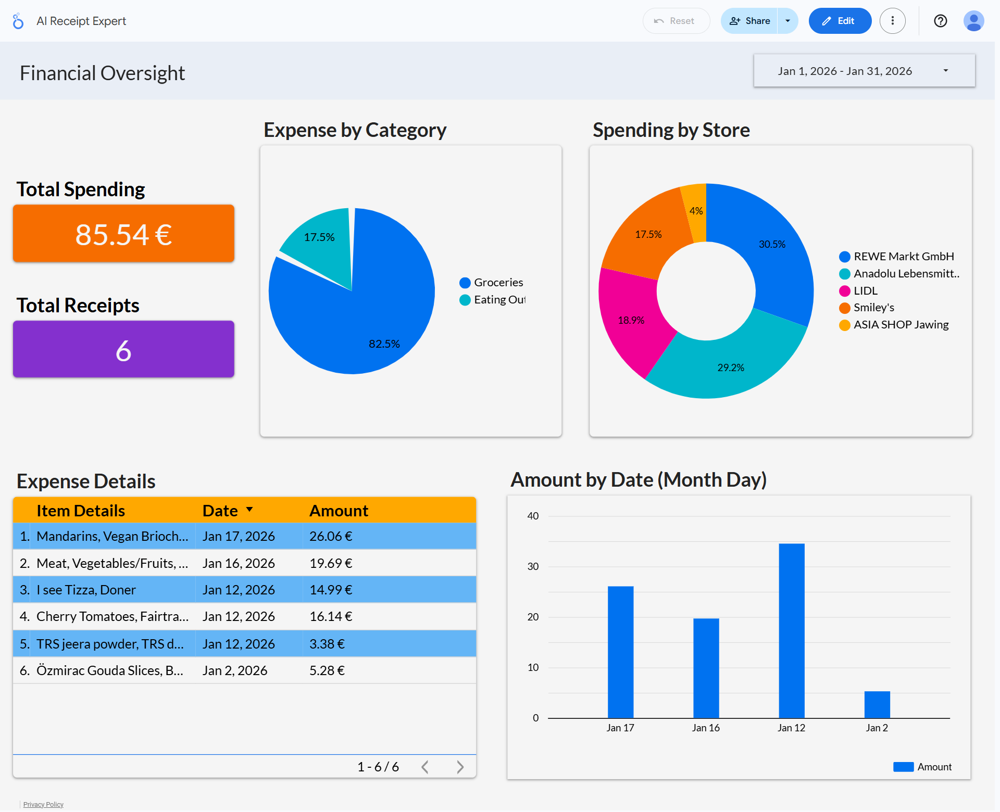

# 🧾 AI Receipt Expert

## 🚀 Project Overview

**AI Receipt Expert** is a fully autonomous financial agent that eliminates manual data entry.

### 🎥 Watch the Demo

I have engineered this solution on **two platforms** so you can choose the architecture that fits your needs. Whether running on **n8n (Self-Hosted)** for zero cost or **Make.com** for ease of use, the logic remains the same: it ingests receipt images, extracts unstructured data via Google Vision, cleans it with GPT-4o, and visualizes trends on a live dashboard.

**The Result:** A privacy-focused, infinitely scalable expense tracking system.

---

## ⚙️ How It Works (The Pipeline)
1.  **Trigger:** Watches a specific **Google Drive** folder for new receipt images (24/7 monitoring).
2.  **OCR Extraction:** Sends the raw image binary to **Google Vision API** to detect text.
3.  **AI Parsing:** Passes the raw unstructured text to **OpenAI (GPT-4o)** with a custom system prompt to identify:
    * 📅 Date (Standardized to YYYY-MM-DD)
    * 🏪 Vendor Name
    * 💵 Total Amount
    * 🏷️ Expense Category (e.g., Travel, Software, Meals)
4.  **Data Structuring:** Converts the AI response into a JSON Object.
5.  **Storage:** Appends the clean data to **Google Sheets** (Database).
6.  **Visualization:** Data is synced to **Google Looker Studio** for real-time analytics.

---

## 🆚 Compare Versions: Which should you use?

| Feature | 🧡 n8n Version | 💜 Make.com Version |
| :--- | :--- | :--- |
| **Best For** | Power Users & Developers | Rapid Deployment |
| **Cost** | **Free** (Self-Hosted) | **Paid** (Per Operation) |
| **Complexity** | High (Requires JSON/JavaScript) | Medium (Visual Builder) |
| **Scalability** | Unlimited Executions | Limited by Plan |
| **File Included** | `n8n-workflow.json` | `make-blueprint.json` |

---

## 📊 Live Analytics Dashboard
Both versions connect to **Google Looker Studio** to provide a real-time visualization of spending habits.

**Key Visualizations:**
* **Total Financial Overview:** A live scorecard tracking total expenditure.
* **Spending Habits:** Breakdown of expenses by **Category** (Groceries vs. Eating Out).
* **Vendor Analysis:** A donut chart highlighting top merchants.

---

## 📥 Setup Guide

### Option A: Using n8n (Recommended for Scale)
1.  **Download:** Get `n8n-workflow.json` from this repo.
2.  **Import:** Open n8n > Workflows > Import Workflow.
3.  **Credentials:** Add your Google Cloud Service Account & OpenAI API Key.
4.  **Run:** Activate the workflow.

### Option B: Using Make.com (Recommended for Speed)
1.  **Download:** Get `make-blueprint.json` from this repo.
2.  **Import:** Create a new Scenario > Click "More" (...) > **Import Blueprint**.
3.  **Connections:** Re-authorize your Google Drive and OpenAI modules.
4.  **Run:** Turn the scenario "ON".

---

## 📬 Contact
**[Your Name]**
*Expert in AI Automation, API Integration, and Financial Operations.*

[Link to your LinkedIn]
